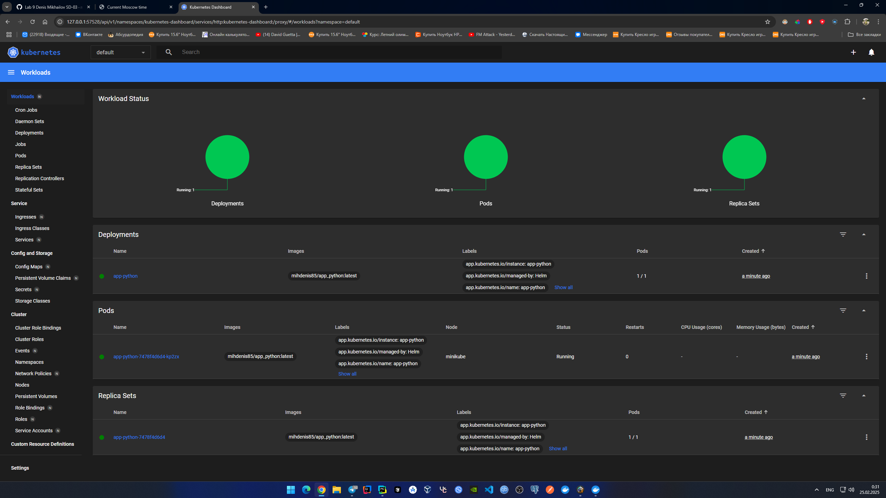

# HELM

## Deploy app-python

Deploy both apps:

```shell
PS C:\Users\mixbe\PycharmProjects\S25-core-course-labs\k8s> helm install app-python app-python
NAME: app-python
LAST DEPLOYED: Tue Feb 25 00:29:31 2025
NAMESPACE: default
STATUS: deployed
REVISION: 1
NOTES:
1. Get the application URL by running these commands:
  export NODE_PORT=$(kubectl get --namespace default -o jsonpath="{.spec.ports[0].nodePort}" services app-python)
  export NODE_IP=$(kubectl get nodes --namespace default -o jsonpath="{.items[0].status.addresses[0].address}")
  echo http://$NODE_IP:$NODE_PORT
PS C:\Users\mixbe\PycharmProjects\S25-core-course-labs\k8s> kubectl get pods,svc 
NAME                              READY   STATUS    RESTARTS   AGE
pod/app-python-7478f4d6d4-kp2zx   1/1     Running   0          32s

NAME                 TYPE        CLUSTER-IP    EXTERNAL-IP   PORT(S)          AGE
service/app-python   NodePort    10.99.252.0   <none>        8080:31864/TCP   32s
service/kubernetes   ClusterIP   10.96.0.1     <none>        443/TCP          23h
```

Validate:

```shell
PS C:\Users\mixbe\PycharmProjects\S25-core-course-labs\k8s> minikube service --all
|-----------|------------|-------------|---------------------------|
| NAMESPACE |    NAME    | TARGET PORT |            URL            |
|-----------|------------|-------------|---------------------------|
| default   | app-python | http/8080   | http://192.168.49.2:31864 |
|-----------|------------|-------------|---------------------------|
|-----------|------------|-------------|--------------|
| NAMESPACE |    NAME    | TARGET PORT |     URL      |
|-----------|------------|-------------|--------------|
| default   | kubernetes |             | No node port |
|-----------|------------|-------------|--------------|
* service default/kubernetes has no node port
! Services [default/kubernetes] have type "ClusterIP" not meant to be exposed, however for local development minikube allows you to access this !
* Starting tunnel for service app-python.
* Starting tunnel for service kubernetes.
|-----------|------------|-------------|------------------------|
| NAMESPACE |    NAME    | TARGET PORT |          URL           |
|-----------|------------|-------------|------------------------|
| default   | app-python |             | http://127.0.0.1:57474 |
| default   | kubernetes |             | http://127.0.0.1:57476 |
|-----------|------------|-------------|------------------------|
* Opening service default/app-python in default browser...
* Opening service default/kubernetes in default browser...
! Because you are using a Docker driver on windows, the terminal needs to be open to run it.
```

Minikube dashboard:

```shell
$ minikube dashboard
🔌  Enabling dashboard ...
    ▪ Using image docker.io/kubernetesui/metrics-scraper:v1.0.8
    ▪ Using image docker.io/kubernetesui/dashboard:v2.7.0
💡  Some dashboard features require the metrics-server addon. To enable all features please run:

        minikube addons enable metrics-server


🤔  Verifying dashboard health ...
🚀  Launching proxy ...
🤔  Verifying proxy health ...
🎉  Opening http://127.0.0.1:43067/api/v1/namespaces/kubernetes-dashboard/services/http:kubernetes-dashboard:/proxy/ in your default browser...
```



## Helm Chart Hooks

Dry-run install:

```shell
PS C:\Users\mixbe\PycharmProjects\S25-core-course-labs\k8s> helm install --dry-run helm-hooks app-python
NAME: helm-hooks
LAST DEPLOYED: Tue Feb 25 00:32:26 2025
NAMESPACE: default
STATUS: pending-install
REVISION: 1
HOOKS:
---
# Source: app-python/templates/post-install-hook.yaml
apiVersion: v1
kind: Pod
metadata:
   name: postinstall-hook
   annotations:
       "helm.sh/hook": "post-install"
       "helm.sh/hook-delete-policy": hook-succeeded
spec:
  containers:
  - name: post-install-container
    image: busybox
    imagePullPolicy: Always
    command: ['sh', '-c', 'echo The post-install hook is running && sleep 15' ]
  restartPolicy: Never
  terminationGracePeriodSeconds: 0
---
# Source: app-python/templates/pre-install-hook.yaml
apiVersion: v1
kind: Pod
metadata:
   name: preinstall-hook
   annotations:
       "helm.sh/hook": "pre-install"
       "helm.sh/hook-delete-policy": hook-succeeded
spec:
  containers:
  - name: pre-install-container
    image: busybox
    imagePullPolicy: IfNotPresent
    command: ['sh', '-c', 'echo The pre-install hook is running && sleep 20' ]
  restartPolicy: Never
  terminationGracePeriodSeconds: 0
---
# Source: app-python/templates/tests/test-connection.yaml
apiVersion: v1
kind: Pod
metadata:
  name: "helm-hooks-app-python-test-connection"
  labels:
    helm.sh/chart: app-python-0.1.0
    app.kubernetes.io/name: app-python
    app.kubernetes.io/instance: helm-hooks
    app.kubernetes.io/version: "latest"
    app.kubernetes.io/managed-by: Helm
  annotations:
    "helm.sh/hook": test
spec:
  containers:
    - name: wget
      image: busybox
      command: ['wget']
      args: ['helm-hooks-app-python:8080']
  restartPolicy: Never
MANIFEST:
---
# Source: app-python/templates/serviceaccount.yaml
apiVersion: v1
kind: ServiceAccount
metadata:
  name: helm-hooks-app-python
  labels:
    helm.sh/chart: app-python-0.1.0
    app.kubernetes.io/name: app-python
    app.kubernetes.io/instance: helm-hooks
    app.kubernetes.io/version: "latest"
    app.kubernetes.io/managed-by: Helm
automountServiceAccountToken: true
---
# Source: app-python/templates/service.yaml
apiVersion: v1
kind: Service
metadata:
  name: helm-hooks-app-python
  labels:
    helm.sh/chart: app-python-0.1.0
    app.kubernetes.io/name: app-python
    app.kubernetes.io/instance: helm-hooks
    app.kubernetes.io/version: "latest"
    app.kubernetes.io/managed-by: Helm
spec:
  type: NodePort
  ports:
    - port: 8080
      targetPort: http
      protocol: TCP
      name: http
  selector:
    app.kubernetes.io/name: app-python
    app.kubernetes.io/instance: helm-hooks
---
# Source: app-python/templates/deployment.yaml
apiVersion: apps/v1
kind: Deployment
metadata:
  name: helm-hooks-app-python
  labels:
    helm.sh/chart: app-python-0.1.0
    app.kubernetes.io/name: app-python
    app.kubernetes.io/instance: helm-hooks
    app.kubernetes.io/version: "latest"
    app.kubernetes.io/managed-by: Helm
spec:
  replicas: 1
  selector:
    matchLabels:
      app.kubernetes.io/name: app-python
      app.kubernetes.io/instance: helm-hooks
  template:
    metadata:
      labels:
        helm.sh/chart: app-python-0.1.0
        app.kubernetes.io/name: app-python
        app.kubernetes.io/instance: helm-hooks
        app.kubernetes.io/version: "latest"
        app.kubernetes.io/managed-by: Helm
    spec:
      serviceAccountName: helm-hooks-app-python
      securityContext:
        {}
      containers:
        - name: app-python
          securityContext:
            {}
          image: "mihdenis85/app_python:latest"
          imagePullPolicy: IfNotPresent
          ports:
            - name: http
              containerPort: 8080
              protocol: TCP
          livenessProbe:
            httpGet:
              path: /
              port: http
          readinessProbe:
            httpGet:
              path: /
              port: http
          resources:
            {}

NOTES:
1. Get the application URL by running these commands:
  export NODE_PORT=$(kubectl get --namespace default -o jsonpath="{.spec.ports[0].nodePort}" services helm-hooks-app-python)
  export NODE_IP=$(kubectl get nodes --namespace default -o jsonpath="{.items[0].status.addresses[0].address}")
  echo http://$NODE_IP:$NODE_PORT
```

Verify without delete policy:

```shell
PS C:\Users\mixbe\PycharmProjects\S25-core-course-labs\k8s> kubectl get po
NAME                                    READY   STATUS      RESTARTS   AGE
helm-hooks-app-python-xnn558685-86adk   1/1     Running     0          31s
postinstall-hook                        0/1     Completed   0          31s
preinstall-hook                         0/1     Completed   0          54s

PS C:\Users\mixbe\PycharmProjects\S25-core-course-labs\k8s> kubectl describe po preinstall-hook
Name:             preinstall-hook
Namespace:        default
Priority:         0
Service Account:  default
Node:             minikube/192.168.49.2
Start Time:       Tue, 25 Feb 2025 0:34:12 +0300
Labels:           <none>
Annotations:      helm.sh/hook: pre-install
Status:           Succeeded
IP:               10.244.0.25
IPs:
  IP:  10.244.0.25
Containers:
  pre-install-container:
    Container ID:  docker://9c3835d15b663c85538325b9caf260cd681ec33d362951f0164ee23558d2404d
    Image:         busybox
    Image ID:      docker-pullable://busybox@sha256:c3839dd800b9eb7603340509769c43e146a74c63dca3045a8e7dc8ee07e53966
    Port:          <none>
    Host Port:     <none>
    Command:
      sh
      -c
      echo The pre-install hook is running && sleep 20
    State:          Terminated
      Reason:       Completed
      Exit Code:    0
      Started:      Tue, 25 Feb 2025 0:34:13 +0300
      Finished:     Tue, 25 Feb 2025 0:34:33 +0300
    Ready:          False
    Restart Count:  0
    Environment:    <none>
    Mounts:
      /var/run/secrets/kubernetes.io/serviceaccount from kube-api-access-w2sl7 (ro)
Conditions:
  Type              Status
  Initialized       True 
  Ready             False 
  ContainersReady   False 
  PodScheduled      True 
Volumes:
  kube-api-access-w2sl7:
    Type:                    Projected (a volume that contains injected data from multiple sources)
    TokenExpirationSeconds:  3607
    ConfigMapName:           kube-root-ca.crt
    ConfigMapOptional:       <nil>
    DownwardAPI:             true
QoS Class:                   BestEffort
Node-Selectors:              <none>
Tolerations:                 node.kubernetes.io/not-ready:NoExecute op=Exists for 300s
                             node.kubernetes.io/unreachable:NoExecute op=Exists for 300s
Events:
  Type    Reason     Age   From               Message
  ----    ------     ----  ----               -------
  Normal  Scheduled  81s   default-scheduler  Successfully assigned default/preinstall-hook to minikube
  Normal  Pulled     81s   kubelet            Container image "busybox" already present on machine
  Normal  Created    81s   kubelet            Created container pre-install-container
  Normal  Started    80s   kubelet            Started container pre-install-container

PS C:\Users\mixbe\PycharmProjects\S25-core-course-labs\k8s> kubectl describe po postinstall-hook
Name:             postinstall-hook
Namespace:        default
Priority:         0
Service Account:  default
Node:             minikube/192.168.49.2
Start Time:       Tue, 25 Feb 2025 0:34:35 +0300
Labels:           <none>
Annotations:      helm.sh/hook: post-install
Status:           Succeeded
IP:               10.244.0.27
IPs:
  IP:  10.244.0.27
Containers:
  post-install-container:
    Container ID:  docker://787a1ea149cdf22c91876db71d99d60c548842f702ee36ba5b6db9c9d0fcacd8
    Image:         busybox
    Image ID:      docker-pullable://busybox@sha256:c3839dd800b9eb7603340509769c43e146a74c63dca3045a8e7dc8ee07e53966
    Port:          <none>
    Host Port:     <none>
    Command:
      sh
      -c
      echo The post-install hook is running && sleep 15
    State:          Terminated
      Reason:       Completed
      Exit Code:    0
      Started:      Tue, 25 Feb 2025 0:34:36 +0300
      Finished:     Tue, 25 Feb 2025 0:34:51 +0300
    Ready:          False
    Restart Count:  0
    Environment:    <none>
    Mounts:
      /var/run/secrets/kubernetes.io/serviceaccount from kube-api-access-6pffd (ro)
Conditions:
  Type              Status
  Initialized       True 
  Ready             False 
  ContainersReady   False 
  PodScheduled      True 
Volumes:
  kube-api-access-6pffd:
    Type:                    Projected (a volume that contains injected data from multiple sources)
    TokenExpirationSeconds:  3607
    ConfigMapName:           kube-root-ca.crt
    ConfigMapOptional:       <nil>
    DownwardAPI:             true
QoS Class:                   BestEffort
Node-Selectors:              <none>
Tolerations:                 node.kubernetes.io/not-ready:NoExecute op=Exists for 300s
                             node.kubernetes.io/unreachable:NoExecute op=Exists for 300s
Events:
  Type    Reason     Age   From               Message
  ----    ------     ----  ----               -------
  Normal  Scheduled  110s  default-scheduler  Successfully assigned default/postinstall-hook to minikube
  Normal  Pulling    110s  kubelet            Pulling image "busybox"
  Normal  Pulled     108s  kubelet            Successfully pulled image "busybox" in 1.961s (1.961s including waiting)
  Normal  Created    108s  kubelet            Created container post-install-container
  Normal  Started    108s  kubelet            Started container post-install-container
```

Install with delete policy and validate:

```shell
PS C:\Users\mixbe\PycharmProjects\S25-core-course-labs\k8s> helm upgrade --install helm-hooks app-python
Release "helm-hooks" has been upgraded. Happy Helming!
NAME: helm-hooks
LAST DEPLOYED: Tue Feb  25 0:44:22 2025
NAMESPACE: default
STATUS: deployed
REVISION: 5
NOTES:
1. Get the application URL by running these commands:
  export NODE_PORT=$(kubectl get --namespace default -o jsonpath="{.spec.ports[0].nodePort}" services helm-hooks-app-python)
  export NODE_IP=$(kubectl get nodes --namespace default -o jsonpath="{.items[0].status.addresses[0].address}")
  echo http://$NODE_IP:$NODE_PORT

# Note that only one application is running with delete policy
$ kubectl get svc,pods
NAME                                        READY   STATUS    RESTARTS   AGE
pod/helm-hooks-app-python-xnn558685-86adk   1/1     Running   0          38s

NAME                            TYPE        CLUSTER-IP       EXTERNAL-IP   PORT(S)          AGE
service/helm-hooks-app-python   NodePort    10.105.189.219   <none>        8080:32389/TCP   38s
service/kubernetes              ClusterIP   10.96.0.1        <none>        443/TCP          23h
```
