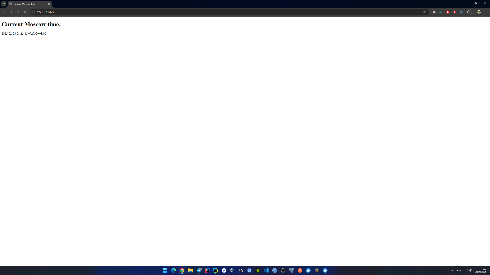

# Kubernetes

## Setup and basics

```shell
PS C:\Users\mixbe\PycharmProjects\S25-core-course-labs> minikube start
* minikube v1.35.0 на Microsoft Windows 11 Pro 10.0.26100.3194 Build 26100.3194
* Используется драйвер docker на основе существующего профиля
* Starting "minikube" primary control-plane node in "minikube" cluster
* Pulling base image v0.0.46 ...
* Обновляется работающий docker "minikube" container ...
! Failing to connect to https://registry.k8s.io/ from inside the minikube container
* To pull new external images, you may need to configure a proxy: https://minikube.sigs.k8s.io/docs/reference/networking/proxy/
* Подготавливается Kubernetes v1.32.0 на Docker 27.4.1 ...
* Компоненты Kubernetes проверяются ...
  - Используется образ gcr.io/k8s-minikube/storage-provisioner:v5
* Включенные дополнения: storage-provisioner, default-storageclass

! C:\Program Files\Docker\Docker\resources\bin\kubectl.exe is version 1.30.5, which may have incompatibilities with Kubernetes 1.32.0.
  - Want kubectl v1.32.0? Try 'minikube kubectl -- get pods -A'
* Готово! kubectl настроен для использования кластера "minikube" и "default" пространства имён по умолчанию
```

Create a deployment and expose:

```shell
PS C:\Users\mixbe\PycharmProjects\S25-core-course-labs> kubectl create deployment app-python --image=mihdenis85/app_python
deployment.apps/app-python created

PS C:\Users\mixbe\PycharmProjects\S25-core-course-labs> kubectl expose deployment app-python --type=LoadBalancer --port=8080
service/app-python exposed
```

Then in the other terminal:

```shell
minikube tunnel
```

Then again in the first terminal:

```shell
PS C:\Users\mixbe\PycharmProjects\S25-core-course-labs> kubectl get pods,svc
NAME                              READY   STATUS    RESTARTS   AGE
pod/app-python-7767888484-gj8bz   1/1     Running   0          95s

NAME                 TYPE           CLUSTER-IP      EXTERNAL-IP   PORT(S)          AGE
service/app-python   LoadBalancer   10.100.42.225   127.0.0.1     8080:32073/TCP   82s
service/kubernetes   ClusterIP      10.96.0.1       <none>        443/TCP          20m
```

Check availability:

```shell
PS C:\Users\mixbe\PycharmProjects\S25-core-course-labs> curl 127.0.0.1:8080
<!DOCTYPE html>
<html>
<head>
    <title>Current Moscow time</title>
</head>
<body>
    <h1>Current Moscow time:</h1>
    <p>2025-02-24 01:22:29.758490+03:00</p>
</body>
</html>
```

Cleanup:

```shell
PS C:\Users\mixbe\PycharmProjects\S25-core-course-labs> kubectl delete deployment app-python
deployment.apps "app-python" deleted
PS C:\Users\mixbe\PycharmProjects\S25-core-course-labs> kubectl delete service app-python   
service "app-python" deleted
PS C:\Users\mixbe\PycharmProjects\S25-core-course-labs> kubectl get svc,pods             
NAME                 TYPE        CLUSTER-IP   EXTERNAL-IP   PORT(S)   AGE
service/kubernetes   ClusterIP   10.96.0.1    <none>        443/TCP   23m
```

## Use deployment and service manifests

```shell
PS C:\Users\mixbe\PycharmProjects\S25-core-course-labs> cd k8s             
PS C:\Users\mixbe\PycharmProjects\S25-core-course-labs\k8s> kubectl apply -f app-python
deployment.apps/app-python created
service/app-python created
PS C:\Users\mixbe\PycharmProjects\S25-core-course-labs\k8s> kubectl get svc,pods
NAME                 TYPE           CLUSTER-IP    EXTERNAL-IP   PORT(S)          AGE
service/app-python   LoadBalancer   10.100.4.39   127.0.0.1     8080:31186/TCP   13s
service/kubernetes   ClusterIP      10.96.0.1     <none>        443/TCP          23m

NAME                              READY   STATUS    RESTARTS   AGE
pod/app-python-76cf47f7fb-c4x4s   1/1     Running   0          13s
pod/app-python-76cf47f7fb-rh9zl   1/1     Running   0          13s
pod/app-python-76cf47f7fb-x4p6c   1/1     Running   0          13s
```

```shell
PS C:\Users\mixbe\PycharmProjects\S25-core-course-labs\k8s> minikube service --all
|-----------|------------|-------------|---------------------------|
| NAMESPACE |    NAME    | TARGET PORT |            URL            |
|-----------|------------|-------------|---------------------------|
| default   | app-python |        8080 | http://192.168.49.2:31186 |
|-----------|------------|-------------|---------------------------|
|-----------|------------|-------------|--------------|
| NAMESPACE |    NAME    | TARGET PORT |     URL      |
|-----------|------------|-------------|--------------|
| default   | kubernetes |             | No node port |
|-----------|------------|-------------|--------------|
* service default/kubernetes has no node port
! Services [default/kubernetes] have type "ClusterIP" not meant to be exposed, however for local development minikube allows you to access this !
* Starting tunnel for service app-python.
* Starting tunnel for service kubernetes.
|-----------|------------|-------------|------------------------|
| NAMESPACE |    NAME    | TARGET PORT |          URL           |
|-----------|------------|-------------|------------------------|
| default   | app-python |             | http://127.0.0.1:64735 |
| default   | kubernetes |             | http://127.0.0.1:64737 |
|-----------|------------|-------------|------------------------|
* Opening service default/app-python in default browser...
* Opening service default/kubernetes in default browser...
! Because you are using a Docker driver on windows, the terminal needs to be open to run it.
```

Python app:



```shell
PS C:\Users\mixbe\PycharmProjects\S25-core-course-labs> curl 127.0.0.1:64735
<!DOCTYPE html>
<html>
<head>
    <title>Current Moscow time</title>
</head>
<body>
    <h1>Current Moscow time:</h1>
    <p>2025-02-24 01:28:02.599351+03:00</p>
</body>
</html>
```
