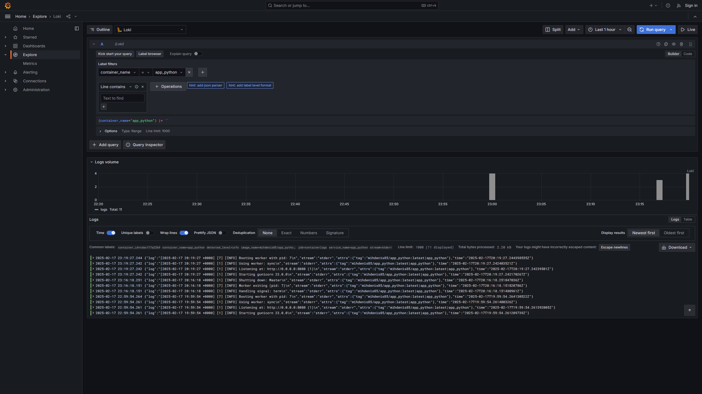
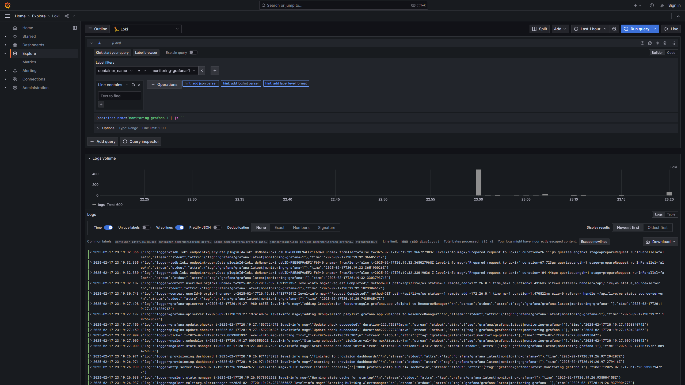
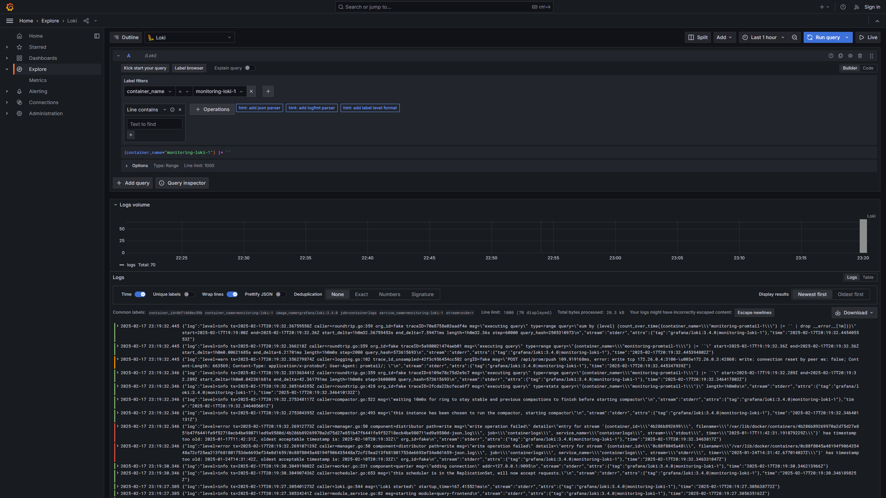
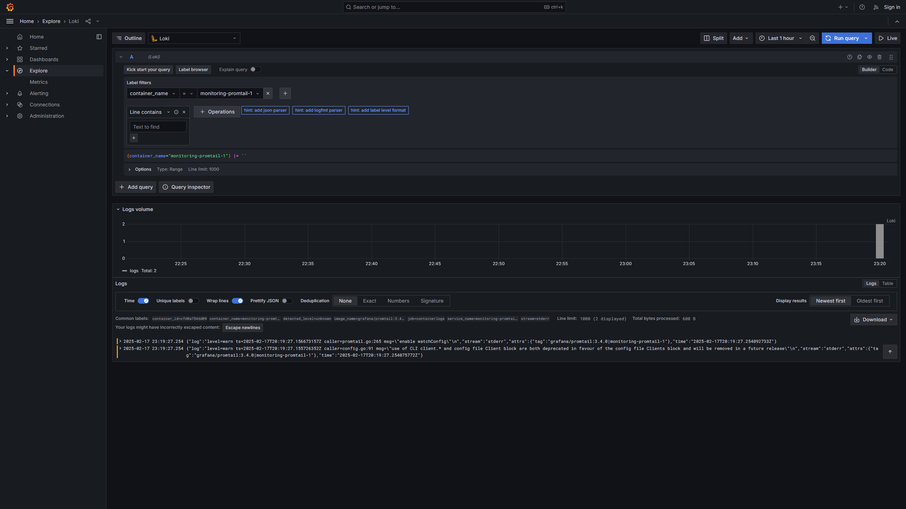

# Monitoring

## Grafana

Grafana is an open-source platform for visualizing and monitoring data
that empowers users to build interactive dashboards. It offers a simple
interface to track, analyze, and display real-time metrics
drawn from different data sources.

## Loki

Loki is a log aggregation system built for horizontal scalability and multi-tenancy.
Created to complement Grafana, it efficiently gathers, stores, and searches logs
from a range of sources, making troubleshooting and deriving insights
from log data much more accessible.

## Promtail

Promtail is a log agent designed to collect logs and forward them
to Loki for storage and analysis. It acts as a bridge between log files and
Loki, ensuring that logs are efficiently gathered, processed, and sent to
a centralized log system for further analysis and monitoring.

## Screenshots

### app_python

### grafana

### loki

### promtail

