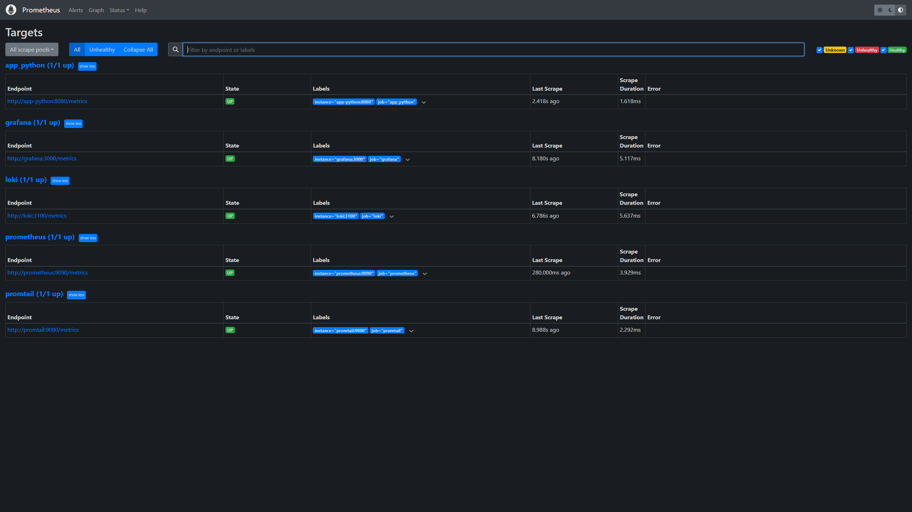
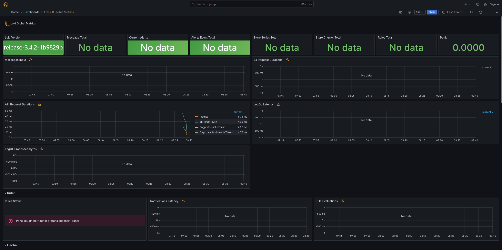
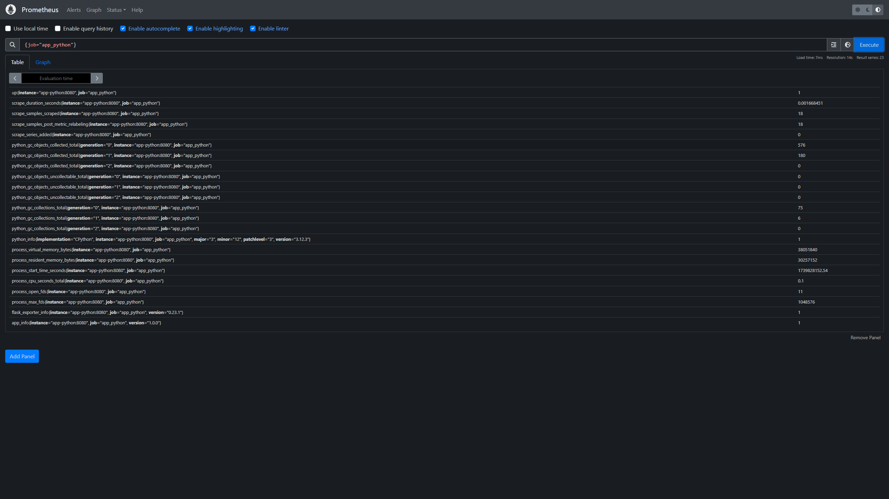

# Metrics

## Prometheus targets

All targets are up:



## Dashboards

Dashboards for Loki and Prometheus:

 

## Web app instrumentation

App is instrumented using prometheus clients:



## Log rotation

Every service is configured to rotate logs like this:

```yaml
x-logging:
  &default-logging
  driver: "json-file"
  options:
    max-size: "200k"
    max-file: "10"
    tag: "{{.ImageName}}|{{.Name}}"
```

## Memory limits

`128M` is enough, I think.

```yaml
x-deploy:
  &default-deploy
  resources:
    limits:
      memory: 128M
```

## Health checks

Every service is health-checked using the following pattern:

```yaml
healthcheck:
      test: ["CMD-SHELL", "curl --fail http://localhost:8080 || exit 1"]
      interval: 10s
      timeout: 3s
      retries: 3
```
